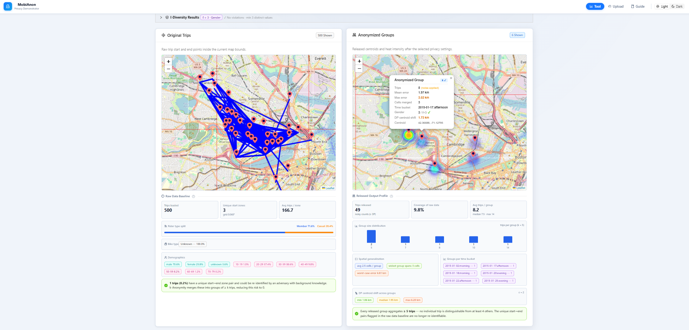
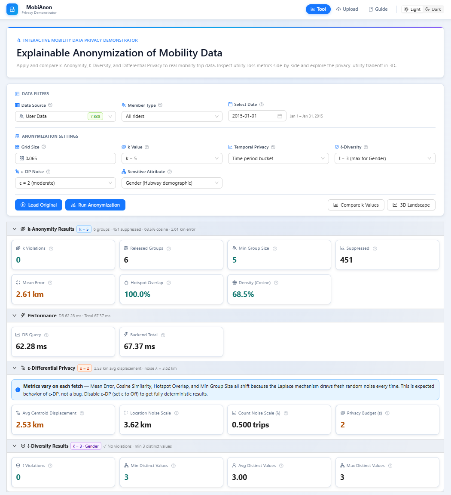
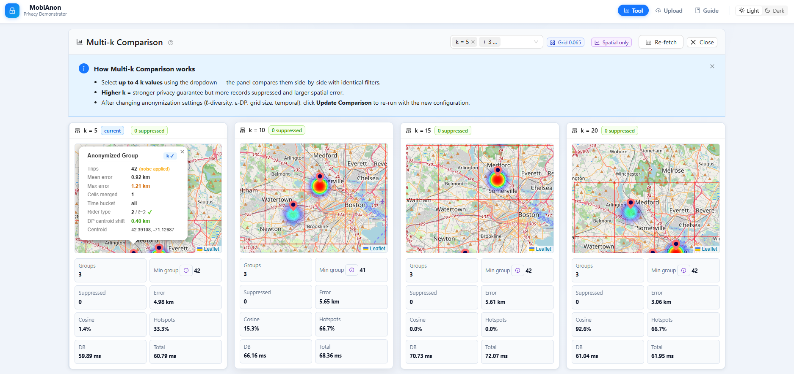
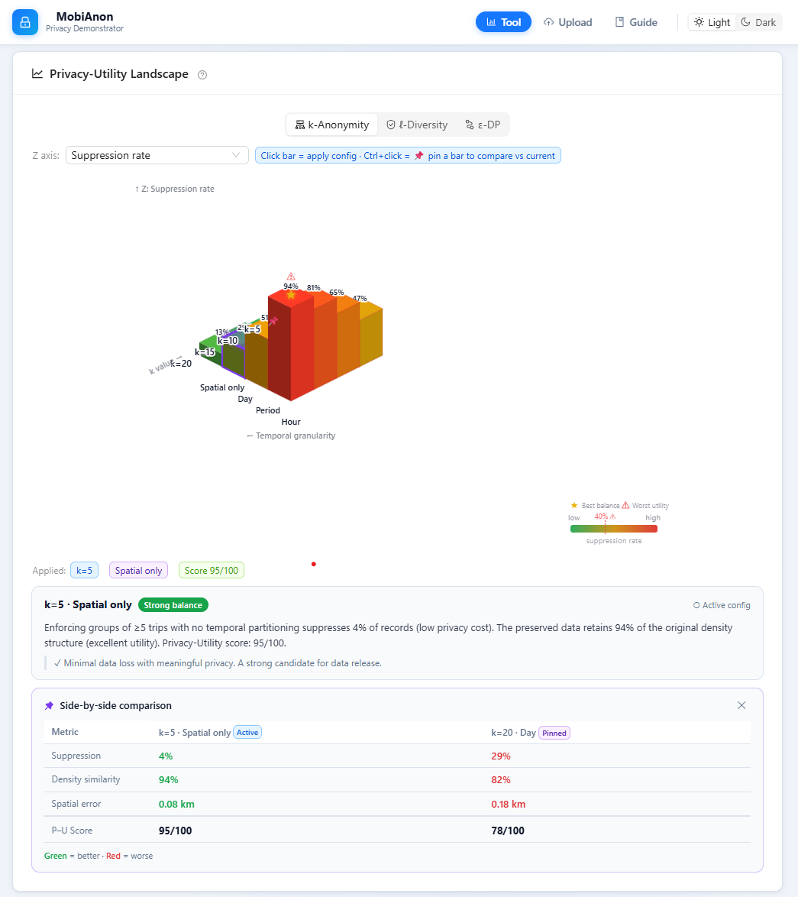
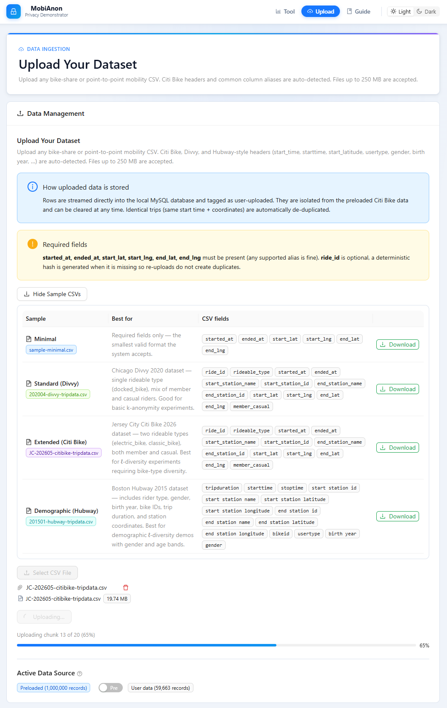
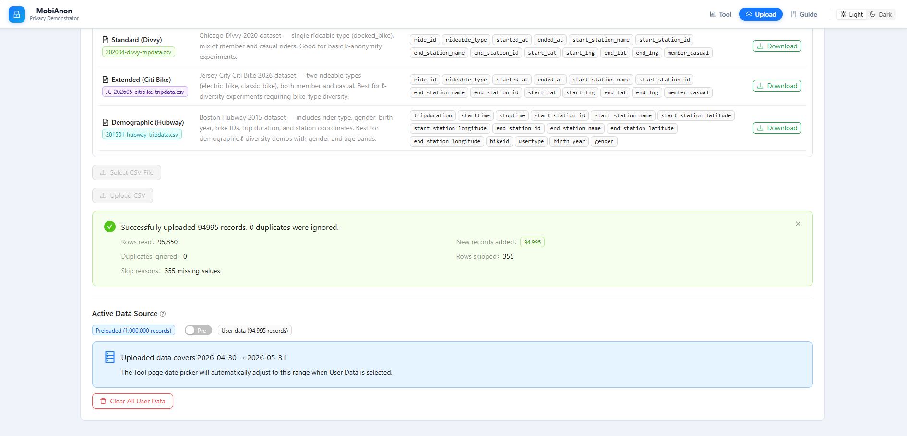
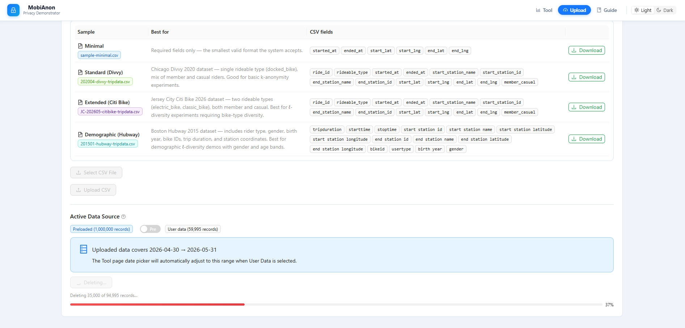
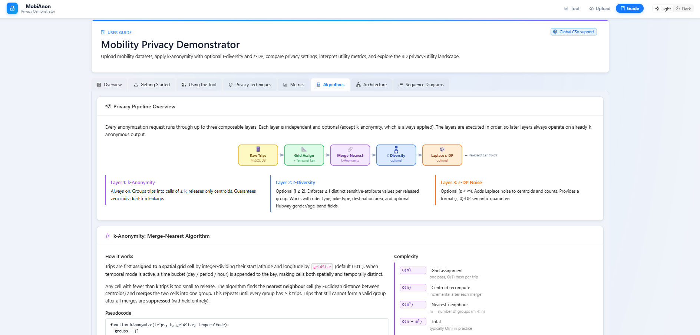

# MobiAnon: Mobility Privacy Demonstrator

MobiAnon is a full-stack React, Express, and MySQL demonstrator for exploring explainable privacy protection on point-to-point mobility trip data. It compares original trip records with anonymized releases and reports privacy/utility metrics such as k-violations, l-diversity violations, suppression, spatial error, density similarity, hotspot overlap, and backend timing.

The project is designed as a research/demo tool, not a production anonymization framework. Its main goal is to make privacy-utility tradeoffs visible through maps, controls, metrics, upload workflows, sample data, benchmark scripts, and an interactive 3D privacy-utility landscape.

The project supports:

- Original vs anonymized map comparison.
- Spatial and spatio-temporal k-anonymity.
- Temporal privacy modes: spatial-only, day, period, and hour.
- Optional l-diversity for rider type, bike type, destination area, gender, and age band.
- Optional epsilon-DP-style Laplace noise on released centroids and counts.
- Multi-k comparison for selected k values.
- Upload of Citi Bike, Divvy, Hubway/Bluebikes-style, or similar mobility CSV files.
- Global latitude/longitude validation instead of NYC-only uploads.
- Resumable 5,000-row chunk upload with retry.
- Clear-all-user-data workflow with streamed delete progress.
- Downloadable minimal, Divvy, Citi Bike, and Hubway sample CSVs.
- Optional Hubway-style metadata: `tripduration`, `bike_id`, `gender`, `birth_year`, and derived `age_band`.
- Dynamic data-source bounds and date ranges for uploaded datasets.
- Light/dark UI themes for demos and screenshots.
- Interactive 3D privacy-utility landscape for k-anonymity, l-diversity, and epsilon-DP scenarios.
- Benchmark scripts and paper-ready report/figure generation.
- Suppression-only and fixed-grid baseline comparison against the merge-nearest anonymization method.

## Visual Overview

The submitted paper focuses on the architecture, anonymization pipeline, and benchmark results. The screenshots below show the application interface that reviewers can inspect when they open this repository.

### 1. Main Tool: Original vs Anonymized Trips



This is the core MobiAnon interaction: raw mobility trips are shown next to the anonymized release so users can visually compare spatial patterns and utility loss.

### 2. Privacy Settings and Metrics



The controls expose grid size, k, temporal privacy, l-diversity, sensitive attributes, and epsilon-DP noise. The metric cards summarize privacy validity and utility loss in the same view.

### 3. Multi-k Comparison



The comparison panel runs the same query for multiple k values, helping users see how stronger anonymity changes suppression, spatial error, density similarity, and hotspot overlap.

### 4. 3D Privacy-Utility Landscape



The 3D landscape gives an interactive overview of privacy-utility tradeoffs across k-anonymity, l-diversity, and epsilon-DP scenarios.

### 5. Upload and Data Management: Resumable Import



The upload page supports user mobility CSV files, sample downloads, resumable chunk upload, and duplicate handling. This screenshot shows a Citi Bike sample being imported in chunks while the application keeps upload progress visible.

### 6. Upload and Data Management: Import Summary



After upload, the page reports rows read, records inserted, duplicate records, skipped rows, validation details, the active user-data count, and the detected date range that will drive the Tool page date picker.

### 7. Upload and Data Management: Clearing User Data



Uploaded data is isolated from the preloaded demo data and can be cleared safely. The delete workflow streams batch progress so users can see how many records have been removed.

### 8. In-App Guide



The guide explains supported CSV formats, privacy models, metrics, and application workflow for users who are not privacy experts.

## Reproducibility

For setup, Laragon/MySQL instructions, database creation, data import, benchmark commands, report generation, and known limitations, see:

[REPRODUCIBILITY.md](./REPRODUCIBILITY.md)

That guide is the primary source of truth for reproducing the current version of the project.

## Quick Start

```bash
npm install
cd bicycle-be
npm install
cd ..
npm run dev
```

Frontend:

```text
http://localhost:5173
```

Backend:

```text
http://localhost:5000
```

## Important Paths

| Path | Purpose |
| --- | --- |
| `src/components/Map/MapCompare.jsx` | Main comparison UI |
| `src/components/Upload/CSVUpload.jsx` | CSV upload/data-source UI |
| `src/components/Viz3D/PrivacyLandscape.jsx` | Interactive 3D privacy-utility landscape |
| `src/pages/Guide.jsx` | In-app user guide |
| `bicycle-be/routes/bicycleRoute.js` | Trip/anonymization API routes |
| `bicycle-be/routes/uploadRoute.js` | CSV upload, sample download, source metadata, and delete API |
| `bicycle-be/services/anonymization.js` | k-anonymity, l-diversity, DP noise, metrics, and baseline methods |
| `bicycle-be/scripts/evaluateAnonymization.js` | Offline anonymization benchmark |
| `bicycle-be/scripts/generateBenchmarkReport.js` | Paper report/figure generation |
| `bicycle-be/scripts/benchmarkDbQueries.js` | Live database query benchmark |
| `bicycle-be/db/create-trips-table.sql` | Clean MySQL schema setup |
| `bicycle-be/db/performance-indexes.sql` | Live query performance indexes |
| `bicycle-be/paper-results/` | Generated paper-facing reports and figures |

## Verification

```bash
npm run build
cd bicycle-be
npm run benchmark:anonymization
npm run report:benchmark
npm run benchmark:db
npm run report:db
```

On managed Windows laptops, `npm run build` may need to be run in a normal terminal if a sandbox blocks the esbuild worker process.

## Scope Notes

- The app expects point-to-point trips with start/end timestamps and coordinates.
- Station-ID-only data, zone-only data, and full GPS trajectories need preprocessing before import.
- The epsilon-DP layer is a per-query demonstrator mechanism and does not include full privacy accounting across repeated API calls.
- Authentication components exist in the codebase, but the main Tool, Upload, and Guide routes are currently public.
