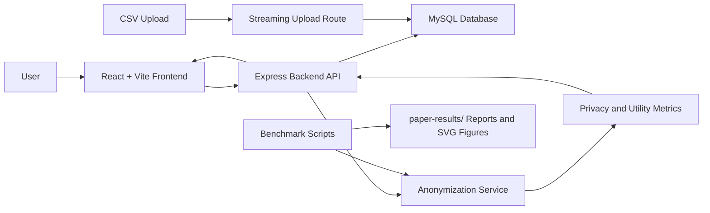

# Mobility Privacy Demonstrator: Application Overview, Architecture, Limitations, and Roadmap

## 1. Purpose of the Application

This application is an interactive demonstrator for explaining privacy protection in mobility datasets. It allows users to compare original trip records with k-anonymized outputs and observe how privacy settings affect data utility.

The central idea is simple:

- Raw mobility data can reveal sensitive movement patterns.
- k-anonymity reduces re-identification risk by ensuring each released group represents at least `k` trips.
- Stronger privacy usually reduces detail, increases spatial distortion, or suppresses records.
- The tool makes this privacy-utility tradeoff visible through maps, metrics, comparisons, and benchmark reports.

Originally, the project focused on January 2024 Citi Bike data from New York City. The current version has been extended toward a more general mobility privacy demonstrator that can also work with similar bike-share or point-to-point mobility CSV datasets from other cities.

## 2. Main Research and Product Goals

The application has two connected goals.

First, it is a research prototype for a thesis/paper context. It supports the argument that explainable visual tools can help users understand k-anonymity, spatial generalization, temporal privacy, suppression, and utility loss.

Second, it is a usable web application. A user can upload mobility data, visualize raw trips, run anonymization, compare different k values, and inspect paper-ready metrics.

The current tool supports:

- Original vs anonymized map comparison.
- Spatial k-anonymity.
- Spatial-temporal k-anonymity.
- Temporal privacy modes: spatial-only, day, period, hour.
- Multi-k comparison for `k=5`, `k=10`, and `k=20`.
- Utility metrics such as spatial error, density similarity, and hotspot overlap.
- Baseline comparison against suppression-only anonymization.
- CSV upload with flexible column aliases.
- Global latitude/longitude validation.
- Streaming upload import for larger CSV files.
- Light/dark theme for demos and screenshots.
- Benchmark scripts and generated paper-ready plots/tables.

## 3. How the Application Achieves Its Goal

The application follows this workflow:

1. A dataset is loaded into MySQL.
2. The frontend asks the backend for trips inside the current map bounds.
3. The user chooses filters such as data source, date, member type, grid size, k value, and temporal privacy.
4. The backend queries raw trips from MySQL.
5. For anonymized output, the backend groups trips into spatial or spatial-temporal buckets.
6. Small groups are merged with nearby groups until each released group satisfies k.
7. Groups that cannot satisfy k are suppressed.
8. The frontend displays original trips and anonymized centroids/heatmaps side by side.
9. The application reports privacy and utility metrics.
10. Benchmark scripts generate reproducible evaluation results and paper-ready figures.

## 4. High-Level Architecture

## 5. Frontend Structure

### `src/App.jsx`

This is the main application shell. It configures routing, Ant Design theme support, and global light/dark mode.

Important responsibilities:

- Wraps the application in `ConfigProvider`.
- Stores the selected theme in local storage.
- Defines routes for:
  - `/`: main tool page.
  - `/upload`: upload/data management page.
  - `/guide`: user guide.
- Passes theme state to the main map page.

### `src/components/Layout/Sidebar.jsx`

This is the left navigation sidebar.

Important responsibilities:

- Shows navigation links for Tool, Upload Data, and Guide.
- Uses Ant Design icons.
- Adapts to light/dark theme mode.

### `src/components/Layout/AppLayout.jsx`

This is a lightweight layout wrapper used around the main pages.

Important responsibilities:

- Provides consistent page content structure.
- Uses CSS classes rather than hardcoded white backgrounds so dark mode works correctly.

### `src/components/Map/MapCompare.jsx`

This is the most important frontend file. It implements the main privacy demonstrator interface.

Important responsibilities:

- Displays the hero/header section.
- Provides the light/dark theme toggle.
- Stores and restores map/filter settings from local storage.
- Lets the user choose:
  - grid size
  - k value
  - temporal privacy mode
  - data source
  - member type
  - date for preloaded data
- Loads original trip data from `/api/trips`.
- Loads anonymized trip data from `/api/trips/anonymized`.
- Displays original and anonymized maps side by side.
- Displays heatmaps and centroids for anonymized groups.
- Shows metric cards:
  - k violations
  - released groups
  - mean error
  - hotspot overlap
  - suppressed records
  - density similarity
  - DB query time
  - backend total time
- Runs multi-k comparison for `k=5`, `k=10`, and `k=20`.
- Fetches source bounds from `/api/upload/data-sources` and recenters maps for uploaded datasets.

### `src/components/Map/FilterComponent.jsx`

This component contains shared filters.

Important responsibilities:

- Lets users choose preloaded data or uploaded user data.
- Lets users choose member type.
- Shows a date picker for preloaded January 2024 data.
- Synchronizes filter changes between original and anonymized maps.
- Provides tooltips explaining filter meanings.

### `src/components/Upload/CSVUpload.jsx`

This component provides the data management interface.

Important responsibilities:

- Lets users select and upload a CSV file.
- Validates file extension and file size on the frontend.
- Explains required fields and supported mobility CSV aliases.
- Calls the backend streaming upload endpoint.
- Shows upload results:
  - rows read
  - records inserted
  - duplicates ignored
  - skipped rows
  - validation summary
- Lets users switch between preloaded and uploaded data.
- Lets users clear uploaded user data.
- Lets users download a sample CSV.

### `src/pages/Guide.jsx`

This is the in-app user guide.

Important responsibilities:

- Explains how to upload data.
- Lists required fields.
- Lists supported aliases.
- Explains how to run the tool.
- Explains controls such as grid size, k, and temporal privacy.
- Explains metrics.
- Explains the suppression baseline at a user-facing level.

### `src/pages/Upload.jsx`

This page wraps the CSV upload component.

Important responsibilities:

- Provides the Upload Data page.
- Hosts `CSVUpload`.

### `src/index.css`

This file contains global styling.

Important responsibilities:

- Defines light/dark theme CSS variables.
- Styles the main app shell.
- Styles sidebar, cards, metric panels, maps, guide page, and comparison panels.
- Adds hover transitions and subtle animation.
- Provides responsive layout behavior for smaller screens.

## 6. Backend Structure

### `bicycle-be/app.js`

This is the Express backend entry point.

Important responsibilities:

- Loads environment variables.
- Creates the Express app.
- Enables CORS and JSON parsing.
- Mounts trip routes under `/api`.
- Mounts upload routes under `/api/upload`.
- Starts the backend server on port `5000` by default.

### `bicycle-be/db/dbConfig.js`

This file configures MySQL connectivity.

Important responsibilities:

- Creates a MySQL connection pool using `mysql2/promise`.
- Supports Windows defaults for Laragon/XAMPP-style MySQL:
  - host: `localhost`
  - port: `3306`
  - user: `root`
  - empty password
- Supports environment variable overrides.
- Performs a startup connection check.

### `bicycle-be/routes/bicycleRoute.js`

This file defines API routes for trip retrieval and anonymization.

Important endpoints:

- `GET /api/trips`
  - Returns original trips inside the selected map bounds.
- `GET /api/trips/anonymized`
  - Returns anonymized groups inside the selected map bounds.

Important responsibilities:

- Validates bounds and required query parameters.
- Validates k value.
- Validates grid size.
- Validates temporal privacy mode.
- Calls the trip service for raw or anonymized results.

### `bicycle-be/services/bicycleTrips.js`

This file centralizes database querying for trips.

Important responsibilities:

- Normalizes query limits.
- Builds SQL queries for current filters.
- Queries MySQL with bounding-box filters.
- Measures DB query time.
- Calls the anonymization service.
- Reports backend timing metrics:
  - `dbQueryMs`
  - `anonymizationMs`
  - `totalBackendMs`
  - `dbRowCount`
  - `queryLimit`

### `bicycle-be/services/anonymization.js`

This is the core privacy and utility logic.

Important functions:

- `applyKAnonymity`
  - Main merge-nearest k-anonymity method.
- `applySuppressionBaseline`
  - Baseline method that suppresses sparse cells instead of merging.

Important internal logic:

- Converts input coordinates to numbers.
- Builds temporal buckets:
  - `none`
  - `day`
  - `period`
  - `hour`
- Assigns trips to grid cells.
- Merges small groups with nearest neighboring groups.
- Suppresses groups that cannot satisfy k.
- Computes centroids.
- Computes privacy/utility metrics:
  - k violations
  - suppressed records
  - released records
  - mean and max spatial error
  - density cosine similarity
  - top-5 and top-10 hotspot overlap
  - point reduction ratio
  - average cells merged

### `bicycle-be/routes/uploadRoute.js`

This file handles CSV upload and data-source metadata.

Important endpoints:

- `POST /api/upload/csv`
  - Uploads and imports a CSV.
- `DELETE /api/upload/user-data`
  - Deletes uploaded user data.
- `GET /api/upload/data-sources`
  - Returns counts and bounds for preloaded/user data.
- `GET /api/upload/sample-csv`
  - Returns a sample CSV.

Important improvements:

- Supports flexible column aliases.
- Accepts global coordinates instead of NYC-only coordinates.
- Generates ride IDs when missing.
- Streams CSV import in chunks.
- Inserts chunks into MySQL while parsing.
- Avoids holding all valid rows in memory.

### `bicycle-be/dataInsert.js`

This is the older preloaded Citi Bike import script.

Important responsibilities:

- Reads `202401-citibike-tripdata.csv`.
- Inserts rows into MySQL in chunks.

Current limitation:

- It still accumulates rows before insertion and is mainly for the known preloaded dataset.
- For very large data, the web upload route now has the better streaming behavior.

### `bicycle-be/db/create-trips-table.sql`

This creates a clean MySQL database/table.

Important responsibilities:

- Creates database `bicycle_data`.
- Creates table `trips`.
- Adds base index `idx_is_user_uploaded`.

### `bicycle-be/db/performance-indexes.sql`

This documents performance indexes for live backend queries.

Important indexes:

- `idx_trips_source_member_date_bounds`
- `idx_trips_source_date_member_bounds`
- `idx_trips_source_bounds`
- `idx_trips_started_at`

These indexes support filtering by data source, member type, date, and map bounds.

## 7. Benchmark and Report Scripts

### `bicycle-be/scripts/evaluateAnonymization.js`

Runs offline anonymization benchmarks from CSV samples.

Important features:

- Supports multiple sample sizes.
- Supports multiple k values.
- Supports multiple temporal privacy modes.
- Supports both:
  - `merge-nearest`
  - `suppression-baseline`
- Supports common non-Citi-Bike column aliases.
- Writes JSON and CSV results to `evaluation-results/`.

### `bicycle-be/scripts/generateBenchmarkReport.js`

Generates paper-ready benchmark reports and SVG plots.

Important outputs:

- `benchmark-report.md`
- `runtime-ms.svg`
- `suppressed-records.svg`
- `mean-spatial-error-km.svg`
- `density-similarity.svg`
- `top10-hotspot-overlap.svg`
- `k-violations.svg`

### `bicycle-be/scripts/benchmarkDbQueries.js`

Benchmarks live MySQL query performance.

Important responsibilities:

- Runs repeated database queries with different limits.
- Records DB query time.
- Stores MySQL `EXPLAIN` plans.
- Writes JSON and CSV results to `evaluation-results/`.

### `bicycle-be/scripts/generateDbBenchmarkReport.js`

Generates a paper-facing report from DB benchmark results.

Important output:

- `paper-results/db-query-benchmark-report.md`

### `bicycle-be/scripts/applyPerformanceIndexes.js`

Applies performance indexes safely.

Important responsibilities:

- Checks whether each index already exists.
- Creates missing indexes.
- Runs `ANALYZE TABLE trips`.

## 8. Generated Paper-Facing Files

### `bicycle-be/paper-results/benchmark-report.md`

Contains benchmark tables for anonymization results, including baseline comparison.

### `bicycle-be/paper-results/evaluation-threat-model.md`

Contains paper-ready text about:

- threat model
- evaluation protocol
- results interpretation
- baseline comparison
- remaining limitations
- ready-to-use paper paragraphs

### `bicycle-be/paper-results/global-dataset-support.md`

Documents global dataset support:

- supported CSV shape
- aliases
- global coordinates
- streaming upload
- remaining dataset limitations

### `bicycle-be/paper-results/db-query-benchmark-report.md`

Summarizes database query performance and index usage.

## 9. Current Data Model

The database uses a normalized point-to-point trip schema.

Core fields:

- `ride_id`
- `rideable_type`
- `started_at`
- `ended_at`
- `start_station_name`
- `start_station_id`
- `end_station_name`
- `end_station_id`
- `start_lat`
- `start_lng`
- `end_lat`
- `end_lng`
- `member_casual`
- `is_user_uploaded`

This schema works well for bike-share and similar mobility trips where each record has one start point and one end point.

## 10. Limitations Identified and How We Addressed Them

### Limitation 1: The original anonymization was too simple

Earlier, anonymization grouped points but did not robustly enforce privacy for all released groups.

How we addressed it:

- Added a stronger `applyKAnonymity` implementation.
- Added nearest-neighbor merging for sparse groups.
- Added suppression for records that cannot satisfy k.
- Added `kViolations` metric.

Current status:

- Benchmarks show zero k-violations across tested configurations.

### Limitation 2: Privacy was spatial-only

The original tool did not sufficiently model attacker knowledge about time.

How we addressed it:

- Added temporal privacy modes:
  - `none`
  - `day`
  - `period`
  - `hour`
- Added spatial-temporal grouping.
- Added UI selector for temporal privacy.

Current status:

- The tool can demonstrate how stricter temporal knowledge increases suppression and spatial distortion.

### Limitation 3: Utility was not measured rigorously

The original visualization showed anonymized points but did not quantify utility loss.

How we addressed it:

- Added mean and max spatial error.
- Added density cosine similarity.
- Added top-5 and top-10 hotspot overlap.
- Added point reduction ratio.
- Added average cells merged.
- Added metric cards in the UI.

Current status:

- The tool now provides quantitative privacy/utility evidence.

### Limitation 4: No baseline comparison

Without a baseline, it was difficult to explain what the merge step contributes.

How we addressed it:

- Added suppression-only baseline.
- Updated benchmark script to run both methods.
- Updated paper report with baseline comparison.

Key result:

- In the strict hour-level `k=20` case, the baseline suppresses all valid records, while merge-nearest releases most records with zero k-violations.

Current status:

- The evaluation is now comparative and much stronger for a paper.

### Limitation 5: Benchmarking was missing

The project originally lacked reproducible algorithm evaluation.

How we addressed it:

- Added `evaluateAnonymization.js`.
- Added `generateBenchmarkReport.js`.
- Added JSON/CSV outputs.
- Added SVG plots.

Current status:

- Paper-ready benchmark artifacts can be regenerated.

### Limitation 6: Live backend performance was not measured

The algorithm benchmark measured CSV samples, but the running app still depended on MySQL query performance.

How we addressed it:

- Centralized backend query logic.
- Added DB timing metrics.
- Added performance indexes.
- Added DB benchmark script and report.

Current status:

- The app reports DB query timing separately from anonymization timing.

### Limitation 7: Upload was Citi Bike and NYC specific

The previous upload path required exact Citi Bike headers and rejected non-NYC coordinates.

How we addressed it:

- Added flexible column aliases.
- Made `ride_id` optional.
- Added global coordinate validation.
- Added source bounds metadata.
- Updated frontend guide and upload copy.

Current status:

- Similar point-to-point mobility datasets from other cities can be uploaded.

### Limitation 8: Upload collected all valid rows in memory

Large files could create memory pressure.

How we addressed it:

- Replaced full-array upload import with streaming chunk import.
- The backend now validates rows and inserts chunks while reading the CSV.

Current status:

- Upload is more realistic for larger monthly or multi-month datasets.

### Limitation 9: UI was not polished for demos

The earlier UI was functional but not presentation-ready.

How we addressed it:

- Added light/dark theme.
- Added metric cards.
- Improved map panels.
- Added icons and hover states.
- Added multi-k comparison cards.
- Updated the guide page.

Current status:

- The tool is more suitable for conference demos and screenshots.

### Limitation 10: Reproducibility was unclear

Setup depended on scattered instructions and older XAMPP/NYC assumptions.

How we addressed it:

- Added `REPRODUCIBILITY.md`.
- Added clean database setup SQL.
- Simplified README.

Current status:

- A reviewer or collaborator can reproduce setup and benchmark generation more easily.

## 11. Remaining Limitations

### Remaining Limitation 1: Full-year and multi-city evidence is still limited

The code now supports larger/global data, but we still need actual evaluation on:

- multiple Citi Bike months
- a full year
- at least one non-NYC bike-share dataset

Why it matters:

- This would support the claim that the tool generalizes beyond the original January 2024 Citi Bike dataset.

### Remaining Limitation 2: Upload progress is still basic

The backend streams uploads, but the frontend only shows a generic uploading state.

Needed improvement:

- Add upload progress.
- Add import job status.
- Show rows processed, inserted, skipped, and duplicates during import.

Why it matters:

- Large uploads may take time, and users need feedback.

### Remaining Limitation 3: Date filtering is still optimized for the preloaded dataset

Preloaded data uses January 2024 assumptions. Uploaded datasets may cover different dates.

Needed improvement:

- Use uploaded data min/max dates from `/api/upload/data-sources`.
- Enable date selection based on actual uploaded data range.
- Add optional date range filtering instead of single-day filtering.

### Remaining Limitation 4: Data model only supports point-to-point trips

The current schema expects each record to have start and end coordinates.

Datasets not directly supported:

- station-ID-only data without coordinates
- zone-based datasets
- full GPS traces
- multi-point trajectories

Needed improvement:

- Add preprocessing/import adapters.
- Add station lookup support.
- Add trajectory simplification for GPS traces.

### Remaining Limitation 5: Frontend bundle is large

Vite build passes but warns that chunks are large.

Needed improvement:

- Lazy-load map page.
- Lazy-load upload page.
- Lazy-load guide page.
- Consider manual chunks for Leaflet and Ant Design.

### Remaining Limitation 6: No formal user study extension yet

The thesis included user feedback, but the current improved tool has not been re-evaluated with users.

Needed improvement:

- Conduct an expert walkthrough.
- Conduct a small user study with tasks.
- Measure whether users understand k, suppression, and utility tradeoffs better after using the tool.

### Remaining Limitation 7: No formal privacy model beyond k-anonymity

The tool does not implement differential privacy, l-diversity, t-closeness, or trajectory privacy.

Needed improvement:

- Add optional comparison with differential privacy for aggregate heatmaps.
- Add l-diversity-style checks for user type if appropriate.
- Add trajectory-specific privacy methods if full trajectories are supported.

## 12. How the Tool Can Be Improved Further

### Improvement 1: Background import jobs

Instead of making the browser wait for the upload request to finish, the backend could create an import job.

Possible design:

1. User uploads CSV.
2. Backend returns `jobId`.
3. Frontend polls `/api/upload/jobs/:jobId`.
4. UI shows progress:
   - rows parsed
   - rows inserted
   - rows skipped
   - duplicate count
   - current status

This would make full-year imports feel much more professional.

### Improvement 2: Dynamic date-range filtering

Add date range controls:

- start date
- end date
- time-of-day range

This would better support multi-month and multi-city datasets.

### Improvement 3: Dataset profiles

When uploading a dataset, the backend could store metadata:

- dataset name
- city/country
- source provider
- date range
- coordinate bounds
- row count
- upload timestamp

Then users could switch between multiple uploaded datasets instead of having one shared user-uploaded bucket.

### Improvement 4: More baselines

Current baseline:

- suppression-only grid baseline

Possible future baselines:

- fixed grid generalization without nearest merging
- clustering-based anonymization
- station-level aggregation
- differentially private heatmap counts

### Improvement 5: Advanced evaluation dashboard

Instead of only generating Markdown/SVG reports, the app could include an evaluation dashboard.

Possible views:

- runtime vs sample size
- suppression vs k
- spatial error vs temporal privacy
- density similarity vs method
- baseline comparison table

### Improvement 6: Export functionality

Users may want to export:

- anonymized groups as CSV
- current map screenshot
- benchmark metrics as CSV
- paper-ready figure bundle

### Improvement 7: Safer large-data architecture

For production-level use:

- use background workers
- store upload jobs in a database table
- stream files from disk
- support cancellation
- show progress
- avoid long-running HTTP requests

### Improvement 8: Better map interaction

Useful additions:

- draw custom bounding box
- click a group to inspect raw count, temporal bucket, and cells merged
- side-by-side synchronized zoom
- toggle heatmap/centroids/grid/routes
- show legend for heat intensity

## 13. 3D and Advanced Interactive Visualization Ideas

The tool could become more intuitive by representing privacy and utility in more visual forms.

### 3D Idea 1: 3D Privacy-Utility Landscape

Create a 3D surface where:

- x-axis = k value
- y-axis = temporal granularity
- z-axis = utility loss or suppression rate

Users could rotate the surface and see how stricter privacy settings increase utility loss.

Implementation option:

- Use Three.js or React Three Fiber.
- Generate points from benchmark results.
- Add tooltip on hover for each configuration.

Benefit:

- Makes the privacy-utility tradeoff visually memorable.

### 3D Idea 2: Extruded City Heatmap

Represent the map as a 3D grid:

- each grid cell becomes a vertical column
- column height = trip density
- color = anonymization status or suppression

Users could switch between:

- raw density
- anonymized density
- difference view

Benefit:

- Helps users understand how spatial generalization changes density patterns.

### 3D Idea 3: Temporal Privacy Cube

Represent data as a cube:

- x-axis = longitude
- y-axis = latitude
- z-axis = time

Each trip or group appears as a point/cluster in space-time.

Benefit:

- Makes spatial-temporal privacy easier to understand.
- Users can see why hour-level privacy is stricter: points become sparse along the time axis.

### 3D Idea 4: Group Merging Animation

Animate the anonymization process:

1. Raw trips appear as dots.
2. Grid cells appear.
3. Sparse cells are highlighted.
4. Sparse cells move or merge toward nearest groups.
5. Final centroids appear.

Benefit:

- This would be excellent for teaching and conference demos.
- It directly explains what the merge-nearest algorithm does.

### 3D Idea 5: Privacy Risk Meter

A 3D or animated dashboard could show:

- risk decreases as k increases
- utility decreases as suppression/spatial error increases
- temporal privacy shifts the balance

Benefit:

- Makes abstract metrics understandable for non-technical users.

## 14. Recommended Next Development Priorities

The strongest next steps are:

1. Add background upload/import progress.
2. Add dynamic date ranges for uploaded datasets.
3. Run evaluation on at least one non-NYC dataset.
4. Add an evaluation dashboard inside the app.
5. Add export of anonymized results.
6. Add 3D privacy-utility visualization.
7. Add code splitting to reduce frontend bundle size.
8. Add a small expert/user evaluation of the improved tool.

## 15. Best Paper Positioning

The project should be positioned as:

> An interactive, explainable mobility privacy demonstrator that helps users understand how spatial and temporal k-anonymity affect utility, using maps, metrics, baseline comparison, and reproducible benchmark reports.

It should not be positioned as:

- a production anonymization framework
- a complete trajectory privacy solution
- a formal differential privacy system

The strongest contribution is explainability:

- users can change privacy settings
- users can observe maps change
- users can inspect metrics
- users can compare k values
- users can compare against a baseline
- researchers can reproduce benchmarks

## 16. Summary

The application has evolved from a Citi Bike-specific visualization prototype into a more general mobility privacy demonstrator. It now has stronger anonymization, temporal privacy, utility metrics, baseline comparison, streaming upload, global dataset support, polished UI, documentation, and reproducible benchmark artifacts.

The most important remaining work is to validate generality with larger and non-NYC datasets, improve long-running upload UX, support dynamic date ranges, and add more advanced visual explanations such as 3D privacy-utility views or group-merging animations.
